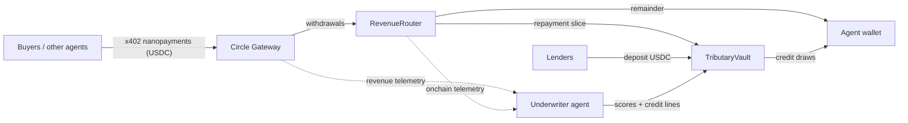

# Tributary

**Credit infrastructure for the agent economy, built on Arc and Circle Nanopayments.**

AI agents that sell services over x402 get paid in thousands of tiny USDC payments. That income stream is the most transparent revenue history any borrower has ever had: cryptographically verifiable, real time, sub-second granularity. Tributary turns it into credit.

- Agents earn a **credit score** from their nanopayment revenue history.
- A **lending vault** extends them USDC working capital against future earnings, priced per second.
- Repayment is **enforced by the payment rail itself**: every incoming payment auto-splits between the lender and the agent until the loan clears. Repayment is plumbing, not a promise.
- The loan book is managed by an autonomous **underwriter agent** that watches live revenue and throttles credit in real time.

In one sentence: we lend money to AI workers and get paid back automatically with a slice of every penny they earn.

## Why Arc

- **USDC is gas and money.** The entire credit lifecycle (deposit, draw, split, repay) stays in one asset.
- **Sub-second finality** makes real-time credit control real: when an agent's revenue stops, the underwriter can throttle its line within a block.
- **Nanopayments (x402 + Circle Gateway)** produce the underwriting data. Sub-cent payments at zero gas mean even a small agent builds a dense, honest revenue history in days.
- **ERC-8004 agent identity** makes reputation portable. A defaulting agent burns an identity worth more than the loan.

## Architecture



Three small contracts:

| Contract | Role |
| --- | --- |
| `TributaryVault` | Lender deposits (share-based), credit lines, per-second simple interest, draws and repayments. Interest paid raises the share price, so lender yield comes from real agent cashflows. |
| `AgentRegistry` | Onboards an agent, deploys its `RevenueRouter`, stores its metadata, ERC-8004 identity and underwriter-posted credit score. |
| `RevenueRouter` | The agent's payout address. On every flush it splits accumulated revenue: while debt is outstanding, a fixed share services the loan and the rest forwards to the agent. Debt cleared means 100% passthrough. |

An Arc-specific detail: native gas and the USDC ERC-20 are two views of the same balance on Arc, so the router handles both plain native transfers and ERC-20 transfers with a single code path.

## The credit loop

1. An agent registers. Its `RevenueRouter` is deployed and becomes its x402 payout address.
2. It sells services (per query, per page, per job) via Nanopayments. Revenue history accumulates in Gateway and on the router.
3. The underwriter agent reads that history, posts a score, and opens a credit line sized to it.
4. The agent draws working capital when a job needs upfront spend (compute, data, API costs).
5. Every payment it earns auto-splits at the router until the debt plus interest is repaid.
6. Its score and limit grow with each clean cycle. Lenders collect the interest.

## Honest threat model

A borrowing agent could redirect its x402 payouts away from its router after drawing. Tributary prices this instead of pretending it away:

- Credit limits start small and grow only with repayment history, so the value of the standing line exceeds any one-time theft.
- The score is anchored to the agent's ERC-8004 identity. Defaulting burns a portable reputation that took real revenue to build.
- The underwriter watches Gateway revenue in real time and throttles the line the moment inflows deviate from the router's telemetry.

This is the same logic that makes unsecured consumer credit work, applied to borrowers whose income is fully observable.

## Repo layout

```
contracts/   Solidity (Foundry): vault, registry, router + tests
agents/      TypeScript: seller, buyer, keeper and underwriter agents
web/         Live Arc loan book, lender actions and deterministic demo
```

## Judge quickstart

The web app reads the proven Arc testnet deployment with no environment setup.
The deterministic pitch path is explicit and labelled:

```bash
pnpm install --frozen-lockfile
pnpm check
pnpm --filter @tributary/web dev
```

- Live Arc state: `http://127.0.0.1:5273/`
- Deterministic demo: `http://127.0.0.1:5273/?demo=1&speed=4`
- Three-minute runbook: [`DEMO.md`](./DEMO.md)

Environment variables in `web/.env.example` are optional overrides for another
deployment. The simulator is never an unlabelled fallback.

## Development

```bash
cd contracts
forge test
```

Deploy to Arc Testnet (chain id 5042002, gas is USDC, faucet at faucet.circle.com):

```bash
UNDERWRITER_ADDRESS=0x... forge script script/Deploy.s.sol \
  --rpc-url https://rpc.testnet.arc.network --broadcast
```

## Live on Arc Testnet

| Contract | Address |
| --- | --- |
| `TributaryVault` | [`0xe13572efdfea23fe04f7cc81f98c083254a44ba8`](https://testnet.arcscan.app/address/0xe13572efdfea23fe04f7cc81f98c083254a44ba8) |
| `AgentRegistry` | [`0x897e3607b3dc5229ed4052ed09af7f6a70ec6c22`](https://testnet.arcscan.app/address/0x897e3607b3dc5229ed4052ed09af7f6a70ec6c22) |
| Demo agent's `RevenueRouter` | [`0xF81EEE56be9Fd9d487A847f35CF4dfe563Eb778d`](https://testnet.arcscan.app/address/0xF81EEE56be9Fd9d487A847f35CF4dfe563Eb778d) |

The full credit loop is proven on testnet with real transactions:

1. A buyer agent paid the seller agent 30 gasless $0.02 x402 nanopayments through Circle Gateway.
2. Gateway batch-settled the earnings; the keeper withdrew them into the agent's RevenueRouter.
3. The underwriter agent scored the agent 139 from its revenue telemetry and autonomously opened a 0.1965 USDC line at 22.22% APR ([open tx](https://testnet.arcscan.app/tx/0x8e975b21f2d9b1c682d12c618e6106753f10411cd59ed30baa6d1bdecebe4159)).
4. The agent drew 0.15 USDC of lender capital.
5. The next revenue flush auto-split at the rail: 0.0393 USDC repaid the vault, 0.1572 USDC reached the agent ([split tx](https://testnet.arcscan.app/tx/0xd669027896e9e68ebae426bd015cb477d5bae94cb8e15eb8152ca0d53d59a70c)).
6. The underwriter re-scored to 268, raised the limit to 0.2947 USDC and cut the rate to 19.64%. Debt is amortizing with every payment the agent earns.

## Status

Built for the Arc Programmable Money hackathon (Encode Club, 2026). Contracts
are deployed and tested, the x402/Gateway credit loop is proven on Arc testnet,
the live loan book reads the chain, and lenders can connect a wallet to deposit
or withdraw testnet USDC. CI repeats the TypeScript build and all Foundry tests
on every push and pull request.
